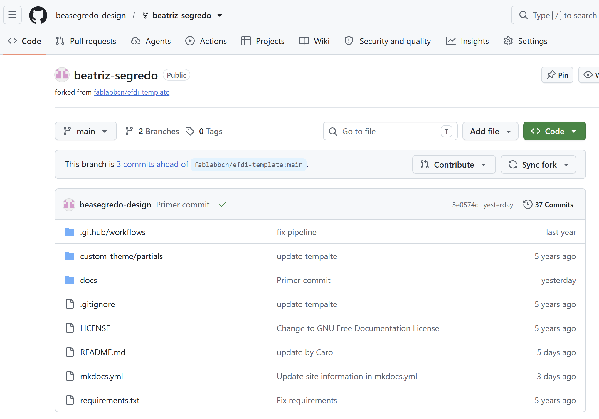
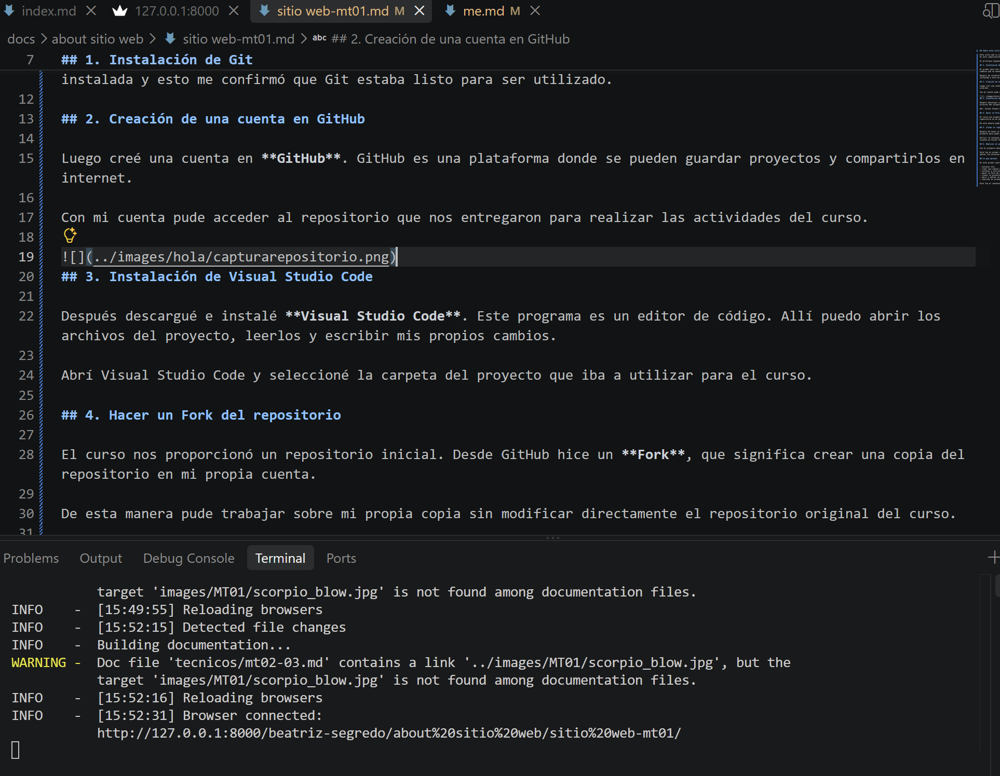

## Sobre este sitio web

Este sitio web lo creé como apoyo visual para documentar mi proceso durante el posgrado en Fabricación Digital. En esta capacitación estoy aprendiendo a trabajar con código, Git, GitHub y Visual Studio Code.

Al principio algunos conceptos me resultaban nuevos, por eso decidí registrar cada paso de forma sencilla.

## 1. Instalación de Git

El primer paso fue instalar **Git** en mi computadora. Git es una herramienta que permite guardar y controlar los cambios que se hacen en un proyecto.

Después de instalarlo, abrí la terminal y comprobé que funcionara correctamente. La terminal mostró la versión instalada y esto me confirmó que Git estaba listo para ser utilizado.

## 2. Creación de una cuenta en GitHub

Luego creé una cuenta en **GitHub**. GitHub es una plataforma donde se pueden guardar proyectos y compartirlos en internet.

Con mi cuenta pude acceder al repositorio que nos entregaron para realizar las actividades del curso.

## 3. Instalación de Visual Studio Code

Después descargué e instalé **Visual Studio Code**. Este programa es un editor de código. Allí puedo abrir los archivos del proyecto, leerlos y escribir mis propios cambios.

Abrí Visual Studio Code y seleccioné la carpeta del proyecto que iba a utilizar para el curso.

## 4. Hacer un Fork del repositorio

El curso nos proporcionó un repositorio inicial. Desde GitHub hice un **Fork**, que significa crear una copia del repositorio en mi propia cuenta.

De esta manera pude trabajar sobre mi propia copia sin modificar directamente el repositorio original del curso.

## 5. Clonar el repositorio

Después de hacer el Fork, cloné el repositorio en mi computadora. Clonar significa descargar una copia local del proyecto para poder trabajar con sus archivos.

Utilicé la terminal para descargar el repositorio y entrar en la carpeta del proyecto. Finalmente abrí esa carpeta en Visual Studio Code para comenzar a trabajar.

## 6. Realizar mi primer cambio

Con el proyecto abierto, busqué el archivo de documentación y escribí mi nombre: **Beatriz Segredo**.

Este fue mi primer cambio en el repositorio. Aunque fue una modificación pequeña, me ayudó a entender que podía editar los archivos y ver esos cambios reflejados en mi sitio web.

## Lo que aprendí

En este primer ejercicio aprendí a:

- instalar Git;
- crear una cuenta en GitHub;
- instalar y utilizar Visual Studio Code;
- hacer un Fork de un repositorio;
- clonar un proyecto en mi computadora;
- abrir y editar un archivo;
- realizar mi primer cambio escribiendo mi nombre.

Este fue el comienzo de mi aprendizaje en Fabricación Digital y del trabajo con herramientas de código.

